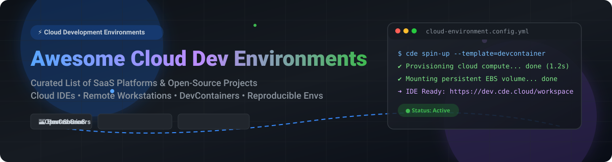

  

  
  
  
  

# 🚀 Awesome Cloud Development Environment (CDE)

> A curated list of **Cloud Development Environments (CDEs)**, **Cloud IDEs**, **Remote Workstations**, **DevContainer tooling**, and **Agent-Ready Workspaces**.

---

## 💡 Overview & Ecosystem Trends

**Cloud Development Environments (CDEs)** allow software engineers to develop, build, test, and debug code in fully managed, remote cloud workspaces. Accessible from any web browser or desktop IDE (VS Code, JetBrains), CDEs eliminate "works on my machine" issues and standardize dev onboarding to minutes.

Key **2026 CDE market trends** include:
- ⚡ **Zero-Setup Onboarding**: Instant container provisioning with pre-installed toolchains using DevContainer specifications (`devcontainer.json`).
- 🤖 **AI Agent Workspaces**: Secure execution sandboxes designed for autonomous AI coding agents (Claude, Codex, Antigravity) with governed cloud permissions.
- 💰 **VDI Replacement**: Modern CDEs are replacing legacy Virtual Desktop Infrastructure (VDI like Citrix/VMware) to cut enterprise licensing costs.
- 🔓 **Open-Source Sovereignty**: Self-hosted solutions (Coder, Daytona, DevPod) provide complete data privacy and cost control over proprietary hosted platforms.

---

## 📖 Table of Contents

- [☁️ SaaS / Hosted Platforms](#%EF%B8%8F-saas--hosted-platforms)
- [🔓 Open-Source GitHub Projects](#-open-source-github-projects)
- [🤝 How to Contribute](#-how-to-contribute)
- [💖 Support & Sponsorship](#-support--sponsorship)
- [📈 Star History](#-star-history)
- [⚠️ Disclaimer](#%EF%B8%8F-disclaimer)

---

## ☁️ SaaS / Hosted Platforms

> **📊 Market Context & Size**: The global Cloud Development Environment (CDE) market size is estimated at **~$6.65B in 2026**, growing toward **~$25B by 2035** at a **~14.2% CAGR**. The IDE-as-a-Service segment alone is projected at **$4.2B in 2026**. The market is **moderately fragmented** — GitHub Codespaces benefits from GitHub's distribution, Gitpod competes on open-source flexibility, and Coder leads self-hosted enterprise deployments. No single vendor holds a winner-take-all position; enterprises typically adopt multi-CDE strategies.

| Platform | Description | Pricing (Starting Tier) | Free Tier Limits | Company Size / Valuation |
|---|---|---|---|---|
| **[AWS Cloud9](https://aws.amazon.com/cloud9/)** | Browser-based IDE with direct AWS service integrations, EC2 compute management, and joint pair-programming. | **$0.00 (Cloud9 software free)**; pay only for underlying **EC2/EBS** resources (e.g., `t3.micro` at **$0.0104/hour**) | **AWS Free Tier**: **750 hours/month** of `t2.micro` or `t3.micro` EC2 compute for 12 months | **~$638B revenue** (Amazon FY2025) |
| **[Google Cloud Workstations](https://cloud.google.com/workstations)** | Enterprise-grade managed dev environments on Google Cloud with IAM policy control and private VPC integration. | **$0.05/hour per vCPU** management fee + underlying Compute Engine VM cost (billed per second) | **Google Cloud Free Trial**: **$300 credit for 90 days** (No perpetual free tier) | **~$350B revenue** (Alphabet FY2025) |
| **[GitHub Codespaces](https://github.com/features/codespaces)** | Native cloud dev environments integrated into GitHub repositories, PRs, and DevContainers. | **2-core VM**: **$0.18/hour**; **4-core VM**: **$0.36/hour**; Storage: **$0.07/GB/month** | **Free (Personal)**: **120 core-hours/month** (~60 hours on 2-core) + **15 GB storage/month** | **~$331.8B revenue** (Microsoft FY2026) |
| **[Replit](https://replit.com/)** | Collaborative browser IDE with native AI Agent, instant deployment, and multiplayer coding. | **Core Plan**: **$20/month** (or **$204/year**) including $20 monthly usage credits | **Starter Plan**: **Free indefinitely** with daily basic AI Agent usage & limited cloud credits | **~$1.16B valuation** (Private) |
| **[Gitpod SaaS](https://www.gitpod.io/)** | Automated CDE platform supporting GitHub, GitLab, Bitbucket, and Gitea with DevContainer standard. | **Individual Plan**: **$9/month** (includes 100 credits) or **$25/month** (unlimited standard usage) | **Free Plan**: **50 hours/month** of standard workspace usage | **~$100M+ raised** (Private) |
| **[CodeSandbox](https://codesandbox.io/)** | Micro-VM sandboxes with instant micro-snapshotting for web apps and Node.js microservices. | **Pico VM (2 cores, 1GB RAM)**: **$0.0743/hour**; **Nano VM (2 cores, 4GB RAM)**: **$0.1486/hour** | **Free Plan**: **400 credits/month** per workspace (~27 hours on Pico VM) | **Acquired by Together AI** (~$50M+ raised prior) |
| **[StackBlitz](https://stackblitz.com/)** | In-browser WebContainers executing Node.js natively inside client browser WebAssembly with zero server latency. | **Pro Plan**: **$18/month** (billed annually) or **$25/month**; **Teams**: **$55/user/month** | **Personal Free Plan**: **Free indefinitely** for unlimited public projects with 1MB upload per project | **~$7.9M raised** (Private) |

---

## 🔓 Open-Source GitHub Projects

Sorted by GitHub star count (descending). Star badges link directly to each repository's stargazers page.

| Repo | Description | Stars |
|---|---|---|
| **[code-server](https://github.com/coder/code-server)** | Run VS Code on any remote Linux/Cloud machine and access it securely through any web browser. (MIT) |  |
| **[GitLab Workspaces](https://github.com/gitlab-org/gitlab)** | Built-in remote development environments for GitLab using Kubernetes and DevContainers. (MIT / EE) |  |
| **[OpenVSCode Server](https://github.com/gitpod-io/openvscode-server)** | Run upstream VS Code directly in web browsers via a single lightweight server binary (~1GB RAM requirement). (MIT) |  |
| **[Daytona](https://github.com/daytonaio/daytona)** | Open-source CDE manager. Provision dev environments on any cloud or local machine with a single CLI command. (AGPL-3.0) |  |
| **[DevPod](https://github.com/loft-sh/devpod)** | Client-only, unopinionated CDE tool using DevContainers on any infrastructure (Docker, K8s, SSH, AWS, GCP). (MPL-2.0) |  |
| **[Gitpod Open-Source](https://github.com/gitpod-io/gitpod)** | Open-source developer platform for ephemeral development environments on Kubernetes. (AGPL-3.0) |  |
| **[Coder](https://github.com/coder/coder)** | Self-hosted CDE platform on Terraform. Provisions enterprise Linux/Windows environments with AI agent governance. (AGPL-3.0) |  |
| **[Eclipse Che](https://github.com/eclipse-che/che)** | Kubernetes-native IDE and developer collaboration platform supporting Devfile standard and OIDC authentication. (EPL-2.0) |  |
| **[Devenv](https://github.com/cachix/devenv)** | Fast, declarative, reproducible developer environments powered by Nix with automatic shell hooks and service containers. (Apache-2.0) |  |
| **[Flox](https://github.com/flox/flox)** | Virtual environment manager built on Nix that bundles software packages and configuration across machines. (GPL-3.0) |  |
| **[Brev](https://github.com/brevdev/brev)** | Dev environment engine for GPUs and cloud instances. Create instant dev boxes with custom setups. (Apache-2.0) |  |

---

## 🤝 How to Contribute

Contributions are welcome and appreciated! Follow these steps to submit a pull request:

1. 🍴 **Fork** this repository.
2. 📝 **Add/Update entries** in `README.md` maintaining table formatting.
3. 🔍 Provide factual project descriptions, specific pricing details, and verified repository star links.
4. 🚀 Submit a **Pull Request** with a brief summary of your changes.

Check out our curated list collection at [Awesome-Awesome-Awesome](https://github.com/ishandutta2007/Awesome-Awesome-Awesome).

---

## 💖 Support & Sponsorship

If you find this repository helpful for your cloud architecture, dev environment setups, or platform engineering research:

- ⭐ **Star** this repository to show your support!
- 🔀 **Fork** and share with colleagues & developer communities.
- ☕ **Buy me a coffee**: Support ongoing open-source research and maintenance via the [GitHub Sponsor Dashboard](https://github.com/sponsors/ishandutta2007).

---

## 📈 Star History

---

## ⚠️ Disclaimer

- This repository is a **community-curated list** for informational and educational purposes.
- All brand names, product logos, and corporate metrics belong to their respective owners.
- Cloud Development Environment prices and quotas are subject to change by cloud providers. Always consult official vendor documentation for up-to-date quotes.
